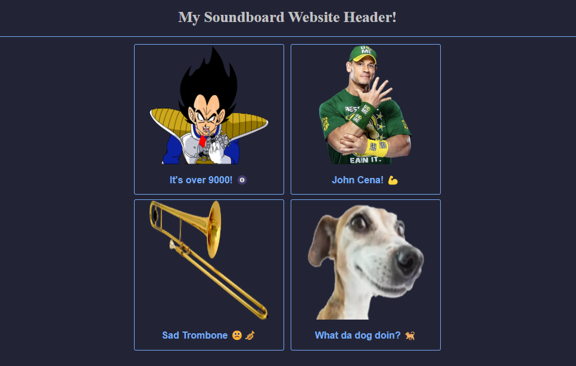

# Example HTML Soundboard
##### _Boilerplate HTML soundboard for beginners_

This repository is a basic template for creating a simple soundboard.

Forking this repo should give you everything you need to get something basic online, hosted under GitHub Pages.

## Features
- Ready to use template for you to play with
- Automatic deployment with GitHub Actions

## Help
 - [Getting Started](https://github.com/andrewiankidd/example-html-css-js/blob/main/assets/help/getting-started.md)

## Screenshot
